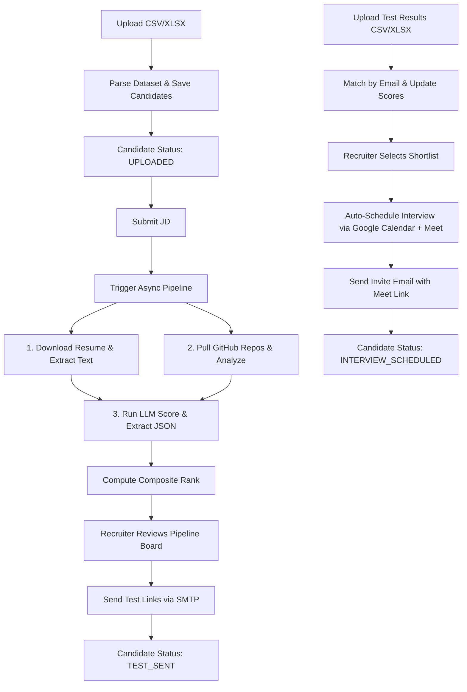

# Master Plan: AI-Powered Candidate Screening Platform

This document details the project goals, technical architecture, data flows, scoring methodology, and governance rules for building the AI-Powered Candidate Screening Platform.

---

## 1. Project Goal
Develop and host a recruiter-facing web application that automates the screening pipeline for candidate selection:
1. **Ingest**: Recruiter uploads a candidate dataset (CSV/XLSX) and provides a Job Description (JD).
2. **Process & Extract**: System downloads resumes from Google Drive share links and extracts candidate information.
3. **Analyze**:
   - **AI Evaluation**: Scores resume + projects + research text against JD using an LLM.
   - **GitHub Analysis**: Analyzes candidate repository-level activity via GitHub API.
4. **Rank & Shortlist**: Calculates a composite score, ranks candidates, and sends aptitude/coding test links.
5. **Test Results**: Recruiter uploads candidate test results (CSV/XLSX) which are merged with existing records.
6. **Schedule**: Auto-schedules Google Meet interviews on Google Calendar for shortlisted candidates and sends confirmation emails.

---

## 2. Directory Structure

```text
assignment/
├── docs/                     # Governance, logs, templates, and agent rules
│   ├── MASTER/
│   │   ├── MASTER_PLAN.md    # [THIS FILE] Folder structure, component architecture, agent roles/scopes
│   │   ├── ARCHITECTURE.md   # DDL schemas, core system constraints, libraries used
│   │   └── PLAN_APPROVED.md  # Active frozen sprint plan
│   ├── WORKING/
│   │   ├── CURRENT_SPRINT.md # Active task list (Todo / In Progress / Done)
│   │   └── CHANGE_PROPOSAL.md# Template for proposing modifications to MASTER plan
│   ├── KNOWLEDGE/
│   │   ├── CHANGE_LOG.md     # Chronological audit trail of architecture/schema changes
│   │   └── findings/         # Numbered diagnostic files for research notes
│   └── AGENTS/
│       ├── backend/
│       │   └── CONTEXT.md    # Scope, owned folders, and rules for Backend Agent
│       └── frontend/
│           └── CONTEXT.md    # Scope, owned folders, and rules for Frontend Agent
├── src/
│   ├── backend/              # FastAPI Application (API, Celery/Workers, Database, Integrations)
│   └── frontend/             # React + Vite + Tailwind + shadcn/ui Application
└── HANDOFF.md                # Root level session handoff file
```

---

## 3. Component Architecture & Data Flow

### 3.1 Component Definitions
1.  **Frontend Recruiter Dashboard**: React + Vite + Tailwind + shadcn/ui.
    *   *Screens*: Upload Dataset, Job Description input, Candidate Pipeline Board (Kanban-style: Uploaded → Resume Processed → AI Scored → Shortlisted → Test Sent → Test Scored → Interview Scheduled), Candidate Detail Drawer, Settings (SMTP, Google OAuth config).
2.  **Backend API (FastAPI)**: REST endpoints for file uploads, scoring pipelines, calendar authorization, SMTP setups. Simple background tasks or Celery + Redis for async workers.
3.  **Resume Processing Service**: Downloads files from Google Drive share links, normalizes direct links, handles virus-scans, and extracts text using PDF/DOCX extractors (`pdfplumber`/`python-docx`/OCR).
4.  **GitHub Analysis Service**: Connects to the GitHub API, retrieves repo listings, evaluates coding languages, commit frequency, CI/CD usage, and calculates a repository-level technical score.
5.  **AI Evaluation Engine**: Connects to an LLM provider (Groq API using Llama 3.1/3.3 or similar) to generate structured evaluation scores and rationales.
6.  **Calendar & Email Integration**: Integrates Google Calendar API (OAuth2) and transactional SMTP template sender using candidate/recruiter credentials.

### 3.2 Data Flow Pipeline


---

## 4. Dataset Schema

### 4.1 Master "Response" CSV/XLSX Sheet
*   `s_no` (Integer): Row identifier.
*   `name` (String): Candidate name.
*   `email` (String): Composite/candidate key (may have duplicates in sheet; generate UUID or use `s_no` + `email` composite constraint).
*   `college` (String): Candidate's college.
*   `branch` (String): Candidate's branch.
*   `cgpa` (Float/Integer): Academic GPA (normalize to float).
*   `best_ai_project` (String): Free text description.
*   `research_work` (String): Free text description (optional, can be empty).
*   `github` (String): Profile URL (e.g. `https://github.com/username`). Needs conversion to repo list query.
*   `resume` (String): Google Drive share link (must convert to direct download URL).
*   `test_la` / `test_code` (Numeric): Treated as null initially until test result upload.

### 4.2 "Test Result" CSV/XLSX Sheet
*   `s_no`, `name`, `email`, `college`, `branch`, `cgpa`, `test_la`, `test_code`
*   Matched to original candidates by `email` (primary key) with `name` and `college` fallback validations.

---

## 5. Scoring & Ranking Methodology

$$\text{Composite Score} = (0.30 \times \text{JD Relevance}) + (0.20 \times \text{Project/Research Quality}) + (0.20 \times \text{GitHub Technical}) + (0.10 \times \text{Academic}) + (0.20 \times \text{Test Performance})$$

### 5.1 Sub-score Rubrics
1.  **JD Relevance Score (30%)**: Derived via LLM evaluation comparing JD vs Resume/Projects. Output: 0–100 score + 2-3 sentence explanation + matched/missing skills.
2.  **Project/Research Quality (20%)**: Derived via LLM evaluating `best_ai_project` and `research_work` for depth, novelty, and verifiability.
3.  **GitHub Technical Score (20%)**: Calculated deterministically (points-based rubric):
    *   Repo count & recency of commits.
    *   Language matches to the JD.
    *   Quality indicators (README, presence of tests, CI/CD configurations).
4.  **Academic Score (10%)**: Normalized CGPA (e.g., scaled to 0-100 based on standard 10.0 scale).
5.  **Test Performance Score (20%)**: Combination of `test_la` (40% weight) and `test_code` (60% weight). Set to 0 if test is not yet completed/uploaded.

---

## 6. Agent Roles and Boundaries

| Agent Role | Directory Scope (Owns) | Read Access (Allowed) | Write Constraints |
| :--- | :--- | :--- | :--- |
| **Backend Agent** | `src/backend/`, `docs/KNOWLEDGE/findings/` | Entire `docs/`, `HANDOFF.md`, `src/backend/` | Never modify `src/frontend/` or any UI files. |
| **Frontend Agent**| `src/frontend/` | Entire `docs/`, `HANDOFF.md`, `src/frontend/` | Never modify `src/backend/` or database schemas. |
| **Lead Architect** | `docs/MASTER/`, `docs/WORKING/`, `docs/KNOWLEDGE/` | Entire workspace | Coordinates and approves agent handoffs and plan updates. |

## 7. Implementation Workflow (The 4-Phase Loop)
All agents must adhere to the 4-phase loop:
1.  **Research & Discovery**: Inspect code/dependencies. Do NOT make changes. Save diagnostic notes in `docs/KNOWLEDGE/findings/00X_topic.md`.
2.  **Implementation Plan & Approval**: Update `implementation_plan.md` in IDE artifacts. Wait for user sign-off.
3.  **Staged Execution**: Track progress via `task.md` in IDE artifacts, updating tasks as `[/]` (in-progress) or `[x]` (completed).
4.  **Verification & Walkthrough**: Validate changes, write `walkthrough.md`, and update `HANDOFF.md` + `docs/KNOWLEDGE/CHANGE_LOG.md`.
